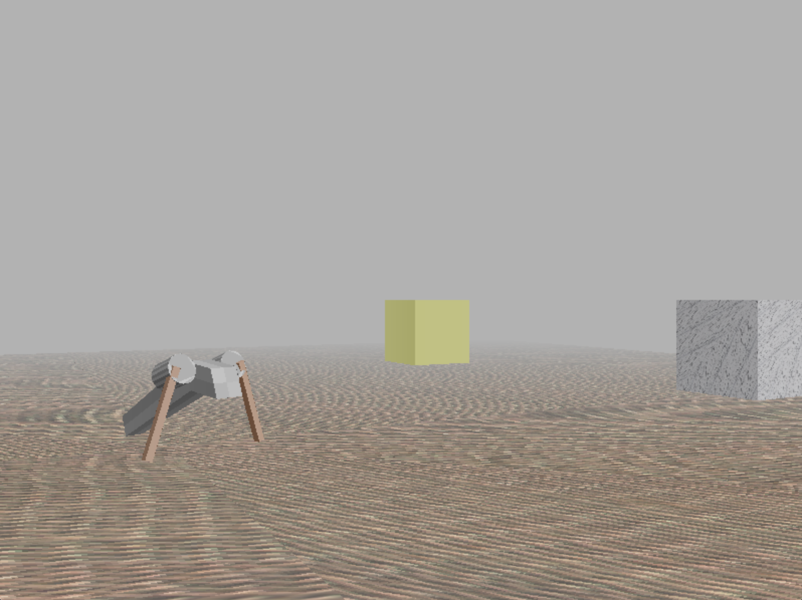

# Robolab

Scene runner and renderer on top of pybullet.

It should evolve into a environment for multiple
agents which learn via reinforcement learning and interface to the 
world via visual sensors. 

